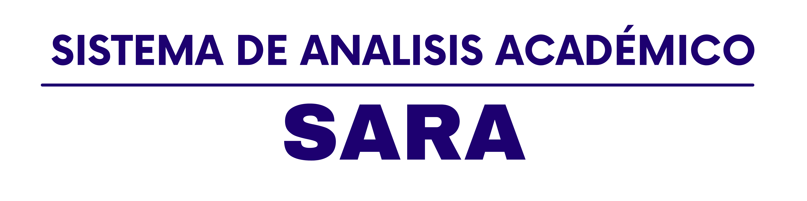

# SARA

  

SARA es una aplicación backend + escritorio para centralizar, procesar y analizar métricas de rendimiento estudiantil y docente. Provee una interfaz gráfica (Java Swing) para la gestión de usua[...]

## Tabla de contenidos
- [Características](#características)
- [Tecnologías](#tecnologías)
- [Requisitos](#requisitos)
- [Instalación](#instalación)
- [Ejecución](#ejecución)
- [Formato de datos (CSV)](#formato-de-datos-csv)
- [Estructura del proyecto](#estructura-del-proyecto)
- [Desarrollo y pruebas](#desarrollo-y-pruebas)
- [Buenas prácticas y mejoras sugeridas](#buenas-prácticas-y-mejoras-sugeridas)
- [Contribuir](#contribuir)
- [Licencia](#licencia)
- [Contacto](#contacto)

## Características
- Interfaz gráfica de usuario desarrollada con Java Swing.
- Gestión de credenciales y notas utilizando CSV para persistencia.
- Módulos para procesar y analizar métricas académicas.
- Exportación/importación de datos en CSV.
- Sistema modular pensado para añadir nuevas métricas e integraciones.

## Tecnologías
- Java SE (la rama del repo indica Java; recomiendo Java 17+ como LTS, verifica compatibilidad si usas JDK 26).
- Java Swing para GUI.
- CSV para persistencia ligera.
- Git & GitHub para control de versiones.

## Requisitos
- Java Development Kit (JDK) instalado. Recomendado: Java 17 (o la versión que uses en tu entorno).
- IDE recomendado: IntelliJ IDEA u otro IDE Java.
- Herramienta de construcción: actualmente no se detecta pom.xml ni build.gradle en la raíz; las instrucciones siguientes usan comandos genéricos de Java. Si quieres que añada un build con Mav[...]

## Instalación
1. Clona el repositorio:
   git clone https://github.com/Enddkito/SARA_Final.git
2. Entra al directorio del proyecto:
   cd SARA_Final
3. Opciones de compilación:
   - Si usas un IDE como IntelliJ, importa el proyecto y compila desde el IDE.
   - Compilación manual (ejemplo simple):
     - Compila los archivos .java:
       mkdir -p out && javac -d out $(find src -name "*.java")
     - Empaqueta en JAR (si tienes una clase Main con el entry point, sustituir "com.tu.Main"):
       jar --create --file SARA.jar -C out .

> Nota: Si prefieres que agregue soporte con Maven o Gradle (pom.xml o build.gradle) para facilitar build y dependencias, indícalo y lo añado.

## Ejecución
- Ejecutar JAR construido:
  java -jar SARA.jar
- O ejecutar desde el IDE: ejecutar la clase que contiene el método `public static void main(String[] args)` (p. ej. `com.tu.organizacion.Main`).

## Formato de datos (CSV)
Explica aquí los CSV usados por el sistema para credenciales, notas y otros. Ejemplo de CSV para usuarios:

usuarios.csv
id,nombre,email,rol,password_hash
1,María Pérez,maria@example.com,estudiante,hash-abc123
2,Juan Gómez,juan@example.com,docente,hash-def456

Ejemplo de CSV para notas:

notas.csv
estudiante_id,curso,actividad,nota,fecha
1,Matemáticas,Parcial 1,85,2026-05-10

Recomendaciones:
- Usar UTF-8 como encoding.
- Evitar comas en campos; en caso necesario, encerrar en comillas.
- Validar que los IDs sean únicos y las notas estén en un rango esperado.

## Estructura del proyecto (ejemplo)
- src/
  - main/
    - java/  — código fuente
    - resources/ — recursos (imágenes, plantillas)
  - test/
- data/ — CSVs de ejemplo
- scripts/ — scripts útiles (ej.: empaquetado, generación de datos)
- README.md
- LICENSE

Ajusta según la estructura real del repo.

## Desarrollo y pruebas
- Ejecutar pruebas unitarias (si se añaden): `mvn test` o `./gradlew test` según la herramienta de build.
- Recomendación: añadir tests unitarios y un conjunto de datos de ejemplo para pruebas manuales.

## Buenas prácticas y mejoras sugeridas
- Añadir un archivo `CONTRIBUTING.md` y `CODE_OF_CONDUCT.md` para facilitar contribuciones.
- Añadir GitHub Actions para build y tests, y exponer un badge en el README.
- Empaquetar una versión distribuible (un único JAR ejecutable).
- Agregar screenshots o un GIF corto en la sección de Uso para mostrar la UI.
- Documentar casos de uso y ejemplos de reportes generados.

## Contribuir
Gracias por tu interés en contribuir. Un flujo sugerido:
1. Haz fork del repo.
2. Crea una branch con un nombre descriptivo: `feature/nueva-funcionalidad` o `fix/correccion`.
3. Realiza commits pequeños y con mensajes claros (ej.: `feat: añadir export CSV` o `fix: corregir validación de notas`).
4. Abre un Pull Request describiendo el objetivo del cambio, pruebas realizadas y cualquier impacto.

Cuando envíes un PR, incluye pruebas o pasos para replicar manualmente los cambios.

## Licencia
Este proyecto está bajo la Licencia MIT. Ver `LICENSE` para más detalles.

## Contacto
Autor: Enddkito (GitHub: @Enddkito)
