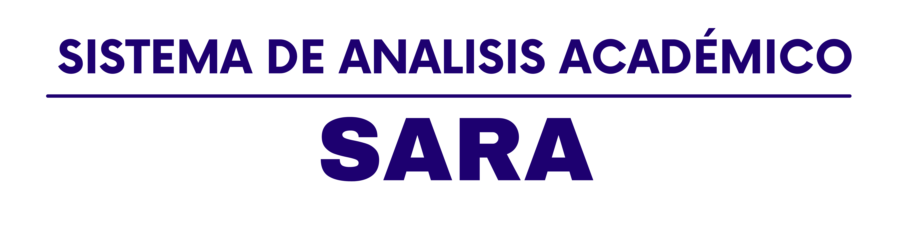

# SARA - Sistema de Análisis de Rendimiento Académico

<p align="center">
  
</p>
[](https://github.com/Enddkito/SARA_Final/actions)
[](https://github.com/Enddkito/SARA_Final/blob/main/LICENSE)
[]()
[]()
[](https://github.com/Enddkito/SARA_Final/commits)

SARA es una aplicación de escritorio modular diseñada para centralizar, procesar y proyectar de manera analítica métricas de rendimiento estudiantil y docente. Provee una interfaz gráfica avanzada e intuitiva que permite el seguimiento en tiempo real del desempeño de asignaturas, la gestión interactiva de calificaciones y el agendamiento formal de tutorías académicas de rescate.

## 📌 Tabla de Contenidos
- [Características del Sistema](#-características-del-sistema)
- [Cumplimiento de Requerimientos Académicos](#-cumplimiento-de-requerimientos-académicos)
- [Tecnologías Utilizadas](#-tecnologías-utilizadas)
- [Estructura del Proyecto](#-estructura-del-proyecto)
- [Formato de Persistencia de Datos (CSV)](#-formato-de-persistencia-de-datos-csv)
- [Arquitectura y Diagrama UML](#-arquitectura-y-diagrama-uml)
- [Instalación y Ejecución](#-instalación-y-ejecución)
- [Licencia](#-licencia)

---

## 🚀 Características del Sistema

*   **Panel del Docente:** Permite la carga interactiva de aportes estructurados por bimestres (Pruebas virtuales, presenciales, exámenes, talleres y deberes) con guardado directo en caliente hacia los ficheros del sistema.
*   **Panel del Estudiante Dinámico:** El entorno adapta de forma genérica las asignaturas y matrículas del estudiante autenticado sin depender de datos quemados o estáticos.
*   **Laboratorio Simulador de Notas Independiente:** Una sección aislada del controlador principal que opera únicamente en la memoria RAM del sistema. Permite al estudiante proyectar sus promedios bimestrales antes de que el docente asiente las notas en el registro físico.
*   **Asistente Predictivo Académico:** Motor analítico que evalúa las notas acumuladas sobre 20 y 40 puntos para arrojar alertas automatizadas de tutorías o estados condicionales de supletorios.
*   **Gestión de Tutorías:** Módulo integrado para la calendarización, procesamiento y exportación automatizada de reportes de acompañamiento pedagógico.

---

## 🎓 Cumplimiento de Requerimientos Académicos

### 1. Interfaces Gráficas de Usuario (GUI)
El frontend de SARA está completamente implementado utilizando **JavaFX** y estructurado mediante archivos **FXML**, separando de forma estricta el diseño visual de la lógica de control. Emplea componentes reactivos avanzados como `TableView`, `TabPane`, `ComboBox` y controles estadísticos dinámicos (`BarChart` y `LineChart`) para el renderizado elástico de tendencias de rendimiento.

### 2. Persistencia de Datos
La persistencia de datos se realiza a través de la gestión de ficheros planos en formato **CSV** procesados por la capa de infraestructura. La carga y escritura de flujos se ejecuta en caliente y en tiempo real, sincronizando los cambios de notas del docente con el panel del estudiante de inmediato.

### 3. Programación Orientada a Objetos (POO) y Pilares
El diseño de la aplicación se rige bajo los pilares fundamentales de la POO:
*   **Encapsulamiento:** Clases de dominio (`Student`, `Professor`, `Course`, `Enrollment`) con atributos privados accesibles de manera controlada mediante métodos *getters* y *setters* y propiedades elásticas de JavaFX (`StringProperty`).
*   **Abstracción:** Modelado de entidades del mundo real universitario adaptadas a tipos de datos complejos y colecciones genéricas de objetos (`List<Course>`, `ObservableList`).
*   **Polimorfismo / Modularidad:** Separación limpia de la arquitectura en capas independientes de Controladores, Dominio, Servicios Lógicos e Infraestructura de datos.

### 4. Validaciones y Manejo de Excepciones
El sistema está blindado contra fallos en tiempo de ejecución (`Runtime Exceptions`) e inconsistencias de datos:
*   **Sanitización de Datos:** Limpieza activa de caracteres residuales de retorno de carro (`\r\n`) en la lectura de archivos CSV para prevenir errores de desfasado en las claves o correos.
*   **Manejo de Errores Numéricos:** Bloques `try-catch` especializados para capturar fallos de formato (`NumberFormatException`) si se ingresan valores inválidos o vacíos durante la edición de notas.
*   **Gestión de I/O:** Captura segura de excepciones de entrada/salida (`IOException`) en la navegación de escenas y flujos de login.

---

## 🛠️ Tecnologías Utilizadas

| Tecnología | Uso en el Proyecto |
|---|---|
| **Java SE 17** | Lógica de negocio, controladores y arquitectura orientada a objetos. |
| **JavaFX 21 / FXML** | Construcción de la interfaz gráfica adaptativa y cartas estadísticas. |
| **IntelliJ IDEA** | Entorno de desarrollo integrado (IDE) utilizado para la depuración y construcción. |
| **Git & GitHub** | Control de versiones distribuido y gestión de ramas integradas de trabajo. |
| **Archivos CSV** | Motor de persistencia para credenciales de acceso, asignaturas y registros de notas. |

---

## 📂 Estructura del Proyecto

```text
src/
└── main/
    ├── java/
    │   └── com/example/sara_ap/
    │       ├── HelloApplication.java      # Punto de entrada de la aplicación (JavaFX)
    │       ├── controller/                # Capa de Controladores de las Vistas FXML
    │       │   ├── HelloController.java   # Controlador del Login y autenticación por roles
    │       │   ├── StudentController.java # Controlador del entorno del alumno y gráficos
    │       │   └── TeacherController.java # Controlador del entorno del docente
    │       ├── domain/                    # Capa de Entidades del Dominio (POO)
    │       │   ├── Course.java
    │       │   ├── Enrollment.java
    │       │   ├── Professor.java
    │       │   └── Student.java
    │       └── services/                  # Capa de Lógica de Negocio y Servicios
    │           ├── PredictiveService.java # Motor de predicciones académicas
    │           ├── SimulationService.java # Motor independiente para el simulador en RAM
    │           └── TutoriaDocumentService.java
    └── resources/                         # Recursos de Configuración e Interfaces
        └── com/example/sara_ap/
            ├── hello-view.fxml            # FXML de la Pantalla de bienvenida
            ├── login-view.fxml            # FXML del Formulario de autenticación
            ├── student-view.fxml          # FXML del Panel del Estudiante y Simulador
            └── teacher-view.fxml          # FXML del Panel de gestión del Docente
